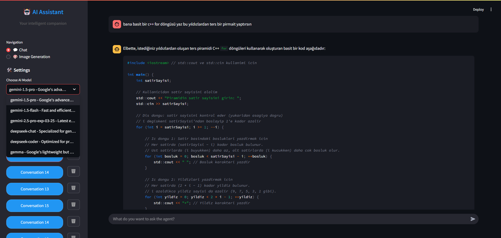

# AI Assistant 🤖

A modern, intelligent AI assistant with chat and image generation capabilities, built with Streamlit and powered by advanced language models.



## ✨ Features

- **Modern, Sleek Interface**: Clean and intuitive design with a dark theme and smooth animations
- **Multi-Model Support**:
  - Gemini Pro (1.5 & 2.5)
  - DeepSeek (Chat & Coder)
  - Gemma
  - Access via OpenRouter (DeepSeek, Gemma)
- **Real-time Chat**: Interactive conversations with AI models
- **Image Generation**: Create AI-powered images using Google's Imagen
- **Conversation Management**: Save and manage multiple chat sessions
- **Responsive Design**: Works seamlessly on desktop and mobile devices

## 🚀 Getting Started

### Prerequisites

- Python 3.8 or higher
- pip (Python package manager)

### Installation

1. Clone the repository:

```bash
git clone https://github.com/yourusername/ai-assistant.git
cd ai-assistant
```

2. Install dependencies:

```bash
pip install -r requirements.txt
```

3. Set up your API keys in `.env`:

```env
GOOGLE_API_KEY=your_google_api_key
OPENROUTER_API_KEY=your_openrouter_api_key
```

4. Run the application:

```bash
streamlit run app.py
```

## 🎯 Usage

1. **Select AI Model**: Choose from various available models in the sidebar
2. **Start a Conversation**: Click "New Conversation" to begin chatting
3. **Chat Interface**: Type your messages in the input field at the bottom
4. **Image Generation**: Switch to the Image Generation tab to create AI-powered images

## 🛠️ Technical Features

- **Streamlit**: Modern web framework for Python applications
- **LangChain**: Framework for developing applications powered by language models
- **Google AI Platform**: Integration for Imagen image generation
- **SQLite Database**: Local storage for conversation history
- **Custom CSS**: Enhanced visual styling and animations

## 🎨 UI/UX Features

- Customized dark theme
- Smooth animations and transitions
- Intuitive navigation
- Clear visual hierarchy
- Responsive message bubbles
- Modern button and input styling
- Loading animations and feedback
- Emoji integration for better visual cues

## 📝 License

This project is licensed under the MIT License - see the [LICENSE](LICENSE) file for details.

## 🤝 Contributing

Contributions are welcome! Please feel free to submit a Pull Request.

## 📞 Support

If you have any questions or run into issues, please open an issue in the GitHub repository.
